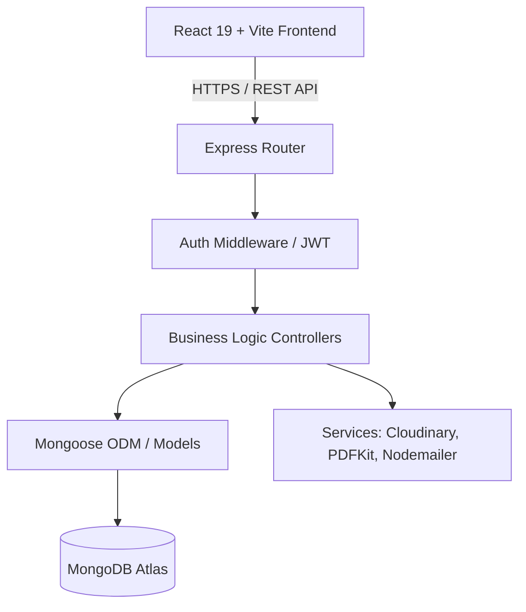

<div align="center">
  <h1>🕌 Faizan-E-Madina : Smart Mosque Management System</h1>
  <h3>An Enterprise-Grade SaaS Architecture for Modern Islamic Centers</h3>
  <p>A comprehensive, full-stack MERN platform designed to digitize and streamline mosque operations, madrasa administration, financial auditing, and community engagement at scale.</p>

  <p>
    
    
    
    
    
    
  </p>
</div>

---

## 📖 Executive Summary

The **Faizan-E-Madina Management System** represents a paradigm shift in traditional Islamic center administration. Built with modern scalability in mind, this platform transitions manual, paper-based ledgers to a highly secure, role-based digital ecosystem. From automated financial receipt generation to real-time academic tracking for Madrasa students, this repository encapsulates a fully-featured, production-ready enterprise suite.

## 🏛️ System Architecture

The overarching architecture follows a decoupled, monolithic repository pattern separating the Client SPA from the RESTful Node instance, communicating strictly via stateless authentication protocols.



## ✨ Enterprise Features

### 🔐 Security & Identity Access Management (IAM)
- **Zero-Trust JWT Auth:** Stateless access token issuance with extensible HttpOnly secure cookie refresh flow capability.
- **Granular RBAC:** Distinct protected dashboard layers for `SuperAdmin`, `Committee Member`, `Volunteer`, and `General User`.

### 🕌 Financial & Operational Automation
- **Digital Ledger & Audit Trails:** Real-time tracking of community donations, automated PDF generation (via PDFKit) for donor receipts, and integrated ledger auditing.
- **Dynamic Event Horizons:** CRUD-based event management, ticketing, community RSVP capability, and automated prayer-timing countdown webhooks.

### 📚 EdTech Module (Madrasa Administration)
- **Academic Ecosystem:** Complete mapping of Courses -> Instructors -> Students.
- **Performance & Certification:** Integrated grading modules and automated system-generated graduation certificates.

### 💻 Engineering & DX
- **Design System Architecture:** Modular, prop-driven custom UI component library built entirely on Tailwind CSS to enforce extreme visual consistency.
- **Data Hydration:** Architecture primed for global state management structures, prepared for edge-caching and optimistic UI updates.

---

## 🛠️ Technical Specifications

### Component Breakdown
| Layer | Technology | Purpose |
| ------ | ----------- | ----------- |
| **Frontend** | React 19, Vite, Tailwind CSS | High-performance SPA, Custom Islamic-Themed UI library |
| **Backend** | Node.js, Express.js | Non-blocking I/O event-driven highly scalable REST API |
| **Database** | MongoDB, Mongoose | NoSQL flexible schema modeling (19 normalized collections) |
| **Security** | bcryptjs, jsonwebtoken | Cryptographic hashing and secure payload transmission |
| **Integrations** | Cloudinary, PDFKit | CDN asset management and server-side PDF buffering |

---

## ⚙️ Development Environment

### Prerequisites
- Node.js (v18.x.x LTS or higher)
- MongoDB Database cluster (Local or Atlas)
- Git CLI

### Local Setup

1. **Clone the repository:**
   ```bash
   git clone https://github.com/kasimshah19/Faizan-E-Madina-Sunni-Masjid.git
   cd Faizan-E-Madina-Sunni-Masjid
   ```

2. **Install Dependencies:**
   ```bash
   npm run install:all
   ```

3. **Environment Configuration:**
   Create `.env` files in both `/client` and `/server` respectively matching their `.env.example` configurations. Minimum configurations include:
   - `MONGO_URI`
   - `JWT_SECRET`
   - `PORT=5000`

4. **Initialize Boot Sequence:**
   ```bash
   npm run dev
   ```
   *The Express backend initializes strictly on PORT 5000; Vite HMR handles the frontend on localhost:5173.*

---

## 🧑‍💻 Core Engineering Team

This highly-scalable web application is architected and engineered by:
- **Backend Infrastructure & System Design:** [Kasim Shah (kasimshah19)](https://github.com/kasimshah19)
- **Frontend & UI/UX Engineering:** Ammar Shaikh & Mohammad Sohel

*Built with passion to push community technology standards to enterprise levels.*
