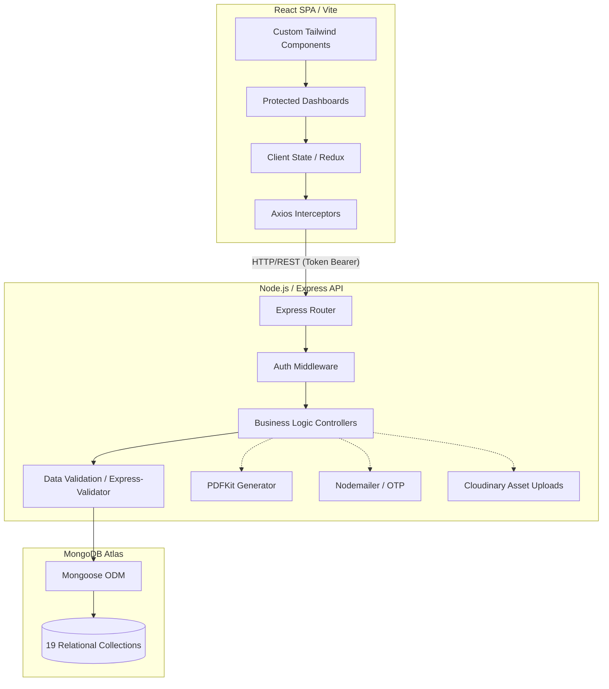

<div align="center">
  
  
  <h1>🕌 Faizan E Madina Management System</h1>
  <h3>An Enterprise-Grade, Full-Stack Mosque & Madrasa Administration Platform</h3>
  
  <p align="center">
    A highly scalable, robust <b>MERN Stack</b> application engineered to modernize Islamic center operations, digitize financial ledgers, automate academic management, and facilitate seamless community engagement.
  </p>

  <p align="center">
    <!-- Frontend -->
    
    
    <!-- Backend -->
    
    
    <!-- Database -->
    
    <!-- Tooling -->
    
    
  </p>
</div>

---

## 🌐 Live Deployment Access

The application is deployed across high-availability cloud infrastructure and is accessible via the links below:

| Application Layer | Environment | Technology | Access / Live URL |
| :--- | :--- | :--- | :--- |
| **Frontend Platform** | Production | Vercel (React Spa) | 🔗 [https://faizan-e-madina-sunni-masjid.vercel.app](https://faizan-e-madina-sunni-masjid.vercel.app) |
| **Backend REST API** | Production | Render.com (Node.js) | 🔗 [https://faizan-e-madina-sunni-masjid.onrender.com](https://faizan-e-madina-sunni-masjid.onrender.com) |
| **Database Cluster** | Production | MongoDB Atlas | 🔒 *Secure Cloud Deployment (No public access)* |

> **Note:** The backend is hosted on a free Render instance and spins down after 15 minutes of inactivity. The initial API call upon opening the frontend may experience a ~50-second cold start delay.

---

## 📖 Executive Overview

Traditional mosque administration relies heavily on manual ledgers and fragmented communication channels. The **Faizan E Madina Management System** solves this by providing a unified, centralized SaaS-like ecosystem. It acts as a digital headquarters—empowering administrators, enabling financial transparency for donors, and streamlining the educational tracking of students within the Madrasa. 

This repository demonstrates the capacity to architect complex, relational data flows within a NoSQL environment, coupled with a highly performant, custom-designed React frontend.

---

## 🚀 Comprehensive Feature Matrix

### 🔐 1. Identity & Access Management (IAM)
- **Role-Based Access Control (RBAC):** Distinct permission hierarchies supporting `SuperAdmin`, `Committee Member`, `Volunteer`, and `Verified Member` roles.
- **Stateless Authentication:** Secure JWT (JSON Web Token) implementation featuring automatic Axios interceptor token refresh cycles.
- **Session Security:** Multi-layered route protection, bruted-force protection logic, and OTP-based verification hooks.

### 💰 2. Financial Automation & Auditing
- **Donation Gateway Tracking:** End-to-end tracking of Zakat, Sadaqah, and general mosque donations.
- **Automated Document Generation:** Server-side PDF generation (powered by `PDFKit`) creating downloadable, verifiable transaction receipts for donors.
- **Data Integrity:** Write-once, append-only systemic Audit Logs mapping all financial actions back to the user invoking them.

### 🎓 3. EdTech: Madrasa Administration
- **Academic Hierarchy:** A deeply relational architecture linking `Madrasas` ➔ `Courses` ➔ `Teachers` ➔ `Students`.
- **Performance Metrics:** Grading functionality and attendance tracking.
- **Graduation Engine:** Automated completion certificate generation upon course finalization.

### 🕌 4. Community & Operational Tooling
- **Dynamic Prayer API:** Real-time Jamaat and Azan timing configuration via the Admin panel, feeding a live countdown widget on the public frontend.
- **Event Orchestration:** Full CRUD capabilities for community events, tracking user RSVPs, and capacity-limited registrations.
- **Communication Hub:** Announcement dispatch system and contact query management.

### 💻 5. Custom Design System
- **Prop-Driven Architecture:** A completely bespoke UI library built with Tailwind CSS. Includes reusable `Buttons`, `DataCards`, `Modals`, `DataTables`, `Skeletons`, and `Progress Indicators`.
- **Responsive PWA-ready Layout:** Fluid layouts scaling from 4K desktop to legacy mobile viewports with zero layout shifts (CLS optimized).

---

## 🏛️ System Architecture

The application strictly adheres to the **Client-Server architecture**, keeping the frontend presentation logic distinctly decoupled from the backend business logic.



---

## 🗄️ Database Entity Relationship (ERD) Highlights

The system leverages **MongoDB (NoSQL)** but enforces strict referential integrity via Mongoose `ObjectIds`. We operate across 19 unique collections. Key relational branches include:

* **Authentication Node:** `User` collection links to specialized profiles (`Member`, `Committee`, `Volunteer`).
* **Financial Node:** `Donation` references `User` (Donor) and `CommitteeMember` (Authorizer).
* **Academic Node:** `Course` references `Syllabus`, `Teacher`, and an array of enrolled `Student` entities.

---

## 🛠️ Technical Stack Specifications

| Domain | Technology / Framework | Implementation Purpose |
| ------ | ----------- | ----------- |
| **Frontend Framework** | React.js (v19), Vite | High-speed Single Page Application (SPA) rendering. |
| **Styling & UI** | Tailwind CSS v4 | Utility-first, highly scalable CSS. Features custom Islamic design tokens. |
| **Backend Environment** | Node.js, Express.js | Event-driven, non-blocking I/O for high-concurrent API request handling. |
| **Database & ORM** | MongoDB Atlas, Mongoose | Flexible JSON-like document storage enforcing strict schemas at the application layer. |
| **Authentication** | JSON Web Tokens (JWT), bcrypt | Cryptographically verified stateless sessions; irreversible password hashing. |
| **Service Integrations** | PDFKit, Cloudinary | Server-side receipt/certificate rendering; Cloud CDN management for user avatars/venues. |

---

## ⚙️ Installation & Developer Setup

### Prerequisites
* **Node.js**: `v18.0.0` or higher required.
* **Database**: MongoDB instance (local or Atlas URI).
* **Package Manager**: npm or yarn.

### Setup Instructions

1. **Clone the Source Code**
   ```bash
   git clone https://github.com/kasimshah19/Faizan-E-Madina-Sunni-Masjid.git
   cd Faizan-E-Madina-Sunni-Masjid
   ```

2. **Install Inter-workspace Dependencies**
   *(Installs dependencies for both the `/client` and `/server` concurrently)*
   ```bash
   npm run install:all
   ```

3. **Configure Environment Secrets**
   Next, create `.env` files in both the root of `/client` and `/server`. Use the provided `.env.example` frameworks. 
   
   **Critical Server Variables:**
   ```env
   PORT=5000
   MONGO_URI=mongodb+srv://<username>:<password>@cluster.mongodb.net/faizan_db
   JWT_SECRET=your_super_secret_cryptographic_key
   ```

4. **Initialize the Development Servers**
   ```bash
   # Boots strictly on PORT 5000 (Backend) & localhost:5173 (Vite Frontend)
   npm run dev
   ```

---

## 🧑‍💻 Core Engineering Team

The architecture, development, and deployment of this enterprise-grade infrastructure were executed by a specialized engineering team. **Roles were strictly delineated** to ensure robust system design and modern UI/UX practices:

* 👑 **[Kasim Shah (Lead Backend Engineer)](https://github.com/kasimshah19)**  
  ➔ **Core Responsibilities:** Node.js/Express API Engineering, Relational NoSQL Database Architecture, Enterprise System Design, Authentication & Security (JWT/RBAC), Cloud Deployment, and Comprehensive End-to-End Testing.

* 💻 **[Ammar Shaikh (Frontend Engineer)](https://github.com/Ammarsk22)**  
  ➔ **Core Responsibilities:** React.js Single Page Application (SPA) Development, State Management, and Tailwind CSS Design Implementation.

* 💻 **[Mohammad Sohel (Frontend Engineer)](https://github.com/m-sohel)**  
  ➔ **Core Responsibilities:** UI/UX Component Engineering, Responsive Web Layouts, and API Integration on the Client-side.

---
> *Architected to push community-driven technology standards to enterprise-grade heights.*
